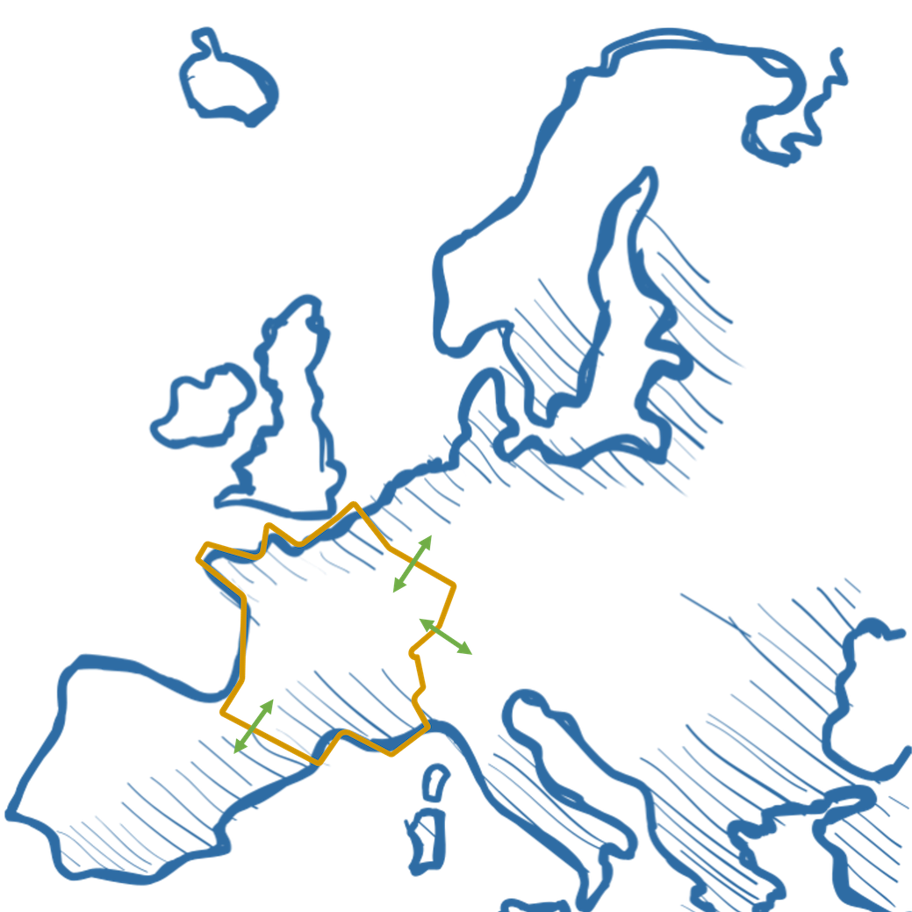

# Transition(s) 2050 / ADEME
Implementation of ADEME scenarios Transition(s) 2050 into ecoinvent database with premise

Description
-----------

This is a repository containing the implementation of the prospective scenarios provided by the 
French Agency for Ecological Transition - ADEME - into ecoinvent for the following sectors in France :

* electricity
* hydrogen
* other liquid and gaseous fuels

It is meant to be used in [`premise`](https://github.com/polca/premise), optionally in addition to a global IAM scenario, to provide 
refined projections at the country level.

This data package contains all the files necessary for `premise` to implement
this scenario and create market-specific composition for electricity (including imports from
neighboring countries), liquid and gaseous fuels (including hydrogen) in the LCA database ecoinvent.

The data relating to the annual production volumes of different energy carriers 
(e.g. electricity, hydrogen) for each Transtion(s) 2050 scenario (6 in number) 
have been formatted and organised in a data package defined by the Frictionless standards 
(Walsh and Pollock, 2022). This data package is read and interpreted by `premise`. 
We therefore store a number of scenarios in a single data package. 

This datapackage contains four files necessary to the scenarios implementation into the ecoinvent LCA database: 

* A datapackage.json file, which provides the metadata for the data package (e.g. authors, scenario descriptions, list and locations of resources, etc.). 
* A config.yaml file which provides the correspondence between the scenario variables and the LCA datasets in the ecoinvent DB, as well as the "LCA datasets to be created" as they are not available in the ecoinvent DB. 
* A tabular data file containing the time series for each variable in the set of scenarios. 
* An optional text file containing the LCA inventories of the "LCA datasets to be created" for any technology not initially present in the ecoinvent DB. 

Sourced from publication
------------------------

Projections are extracted from:

Transition(s) 2050\
ADEME\
[`Website`](https://www.ademe.fr/les-futurs-en-transition/) \
[`Full Report`](https://librairie.ademe.fr/recherche-et-innovation/5072-prospective-transitions-2050-rapport.html) \
[`Data repository`](https://data-transitions2050.ademe.fr/)

Authors of this data package
----------------------------

* Joanna Schlesinger (joanna.schlesinger@minesparis.psl.eu)
* Romain Sacchi (romain.sacchi@psi.ch)
* Juliana Steinbach (juliana.steinbach@minesparis.psl.eu)
* Thomas Beaussier (thomas.beaussier@minesparis.psl.eu)
* Paula Perez-Lopez (paula.perez_lopez@minesparis.psl.eu)

Acknowledgement : Thank you to ADEME's experts, especially Jean-Michel Parrouffe, for providing datasets and helping us better understanding the dataset.

Funding
-------

This work is supported by the ADEME agency, in the context of
the [`HYSPI project`](https://www.psi.ch/en/ta/projects/hyspi).

Ecoinvent database compatibility
--------------------------------

ecoinvent 3.9.1 cut-off

Prospective scenarios
---------------------------
ADEME provides 5 scenarios : 
* S1 : Frugal generation (Génération Frugale) > The transition is driven mostly by sobriety and constraint.
* S2 : Territorial cooperation (Coopération territoriale) > The society transformation is based on a shared governance and on territorialization strategies.
* S3 Renew : Green technologies based on renewables development (Technologies vertes) > The transition is based on innovation and development of low carbon technologies, especially renewable energies.  
* S3 Nuc : Green technologies based on nuclear development (Technologies vertes) > The transition is based on innovation and development of low carbon technologies, especially nuclear energy.  
* S4 : Repairing bet (Pari réparateur) > The transition relies highly on new technologies development, without any society lifestyle changes. 

Informations about scenarios : [`here in French`](https://www.ademe.fr/les-futurs-en-transition/les-scenarios/)

IAM scenario compatibility
---------------------------

The ADEME French scenarios can be connected to any Integrated Assessment Model (IAM) provided by premise. 
[`Link to explore IAM scenarios`](https://premisedash-6f5a0259c487.herokuapp.com/)  

What does this notebook do?
------------------

This external scenario creates electricity, hydrogen and fuel markets for France listed below, according
to the projections from the ADEME's Transition(s) 2050 (yellow boundaries in map above).

Electricity
------------------
\
Few informations about scenarios
*****
* The total electricity produced increases from S1, to S2, to S3 Renew, to S3 Nuc to S4 (from 415 TWh/year in 2050 in S1 to 821 TWh/year in 2050 in S4).
* In S1, S2, S3 Renew, there is no additional development of nuclear capacity compared with S3 Nuc and S4 that rely on nuclear development.
* One of the main differences with RTE prospective study "Futurs énergétiques 2050" is that hydrogen is not used to balance the electricity grid. The balance of the grid relies on gaz turbines powered by a mix of decarbonised gaz.
* The other flexibility technologies considered in ADEME's study are stationnary batteries and pumped hydro storage.

  
\
Input Data
*****
\
**Data Sources**
* **WARNING !** The data used are not the ones provided in the report but was directly provided by ADEME. This data was computed with an assumption of 39 GW of interconnexion (compared with 45 GW for the initial data shared in the report). The data was computed with this new assumption to better fit with RTE projections.
* Dedicated report on electric mix : [`Feuilleton mix électrique`](https://librairie.ademe.fr/energies-renouvelables-reseaux-et-stockage/5352-prospective-transitions-2050-feuilleton-mix-electrique.html)
* Discussions with ADEME experts

**How the data provided by ADEME has been modified ?**\

###### Hydro electricity production data
As the data provided by ADEME is not divided in reservoir hydro and run-of-river hydro, the actual percentage of repartition between both technologies as been applied to generate production data for both technologies. The percentage has been calculated based on market for electricity, high voltage (FR) taken from ecoinvent 3.10 : 84% for run-of-river and 16% for reservoir technologies.\

###### Hydro electricity production data
As the data provided by ADEME is not divided in reservoir hydro and run-of-river hydro, the actual percentage of repartition between both technologies as been applied to generate production data for both technologies. The percentage has been calculated based on market for electricity, high voltage (FR) taken from ecoinvent 3.10 : 84% for run-of-river and 16% for reservoir technologies.\

###### Fuel oil and gas CHP production data
In the data file provided by ADEME, Combined Heat and Power (CHP) powered by fuel oil and gas from the grid is aggregated. To disagregate them the following proxy has been used : we considered 2.3 TWh/year* of electricity production based on fuel oil in 2020, the half (1.15 TWh/year) in 2025 and 0 TWh/year in 2030 as according to ADEME's expert, the production of electricity from oil is planned to be completely stopped. *This data was taken from RTE, "Futurs Energétiques 2050" study for the year 2019. \

###### Exports modelling : change of production volumes of "primary" electricity
As we aim to model the electricity mix consumed in France, the production data used has thus been resized by substracting the exports from the volumes of "primary" electricity produced. Modeling the exports this way involves that : 
* the exports are taken from the "primary" electricity production (ie the electricity that is not consumed then injected by flexibility technologies).
* the electricity consumed then injected by flexibility technologies is only dedicated to French electricity market.\

**Remarks about input data**
* Electricity data is provided for every 5 years from 2020 to 2060.
* In the data file provided by ADEME, the 2020 data is not the same for Combined Cycle Gaz Technology (0.8 TWh/year to 2.2 TWh/year). The data has not been changed and is thus different for each scenario.  
  * The **nuclear electricity** is modeled with Pressurised Water Reactor Technology (PWR) as we do not get disagregated data between PWR and Evolutionary Pressurised Reactor (EPR). New EPR capacity (except Flamanville) is developed in S3 Nuc and S4 but not in S1, S2, and S3 Renew. Therefor this modeling choice affect more S3 Nuc and S4 than S1, S2, S3 Renew. No Small Modular Reactor (SMR) technology is considered in any scenario.
* There are 3 ways of **producing electricity from gas** in ADEME's scenarios :
  * Cycle turbines powered by the gas from the grid (mix between natural gas, biogas, and synthesis gas). Open-Cycle Gas Turbines (OCGT) electricity production was merge with Combined Cycle Gas Turbines (CCGT) electricity production and modeled with a CCGT inventor. This modeling choice is justified by a low amount of electricity produced by OCGT in all scenarios. 
  * Combined Heat and Power powered by gas from the grid
  * Combined Heat and Power powered locally only by biogas
Combined Heat and Power of biogas is thus considered in two different activities, to differenciate the use of dedicated local production of biogas or of the biogas that is injected in the grid.

**To do later**
* connect mix_gas_cycle_turbines and mix_gas_chp to the new gaz market.\

\
Electricity production inventories
******
The inventories datasets listed below are used to model the different ways of producing electricity:
| Technologies in Tr2050+             | LCI datasets used                                                          | Source         |
|-------------------------------------|----------------------------------------------------------------------------|----------------|
| Nuclear, Pressure water reactor     | electricity production, nuclear, pressure water reactor - FR               | ecoinvent 3.9.1|
| Gas, Combined Heat and Power        | heat and power co-generation, natural gas, conventional power plant, 100MW electrical, FR| ecoinvent 3.9.1|
| Coal                                | electricity production, hard coal - FR                                     | ecoinvent 3.9.1|
| Oil                                 | electricity production, oil - FR                                           | ecoinvent 3.9.1|
| Gas, Combined Cycle Turbine         | electricity production, natural gas, combined cycle power plant - FR       | ecoinvent 3.9.1|
| Photovoltaic                        | electricity production, photovoltaic - FR                                  | Datasets provided by premise adapted from 10.13140/RG.2.2.17977.19041. |
| Wind turbines, Onshore              | electricity production, wind, 1-3MW turbine, onshore - FR                  | ecoinvent 3.9.1|
| Wind turbines, Offshore             | electricity production, wind, 1-3MW turbine, offshore - FR                 | ecoinvent 3.9.1|
| Sea, wave                           | electricity production, wave energy converter - RER                        | Dataset provided by premise from 10.1007/s11367-018-1504-2 as explained [`here`](https://premise.readthedocs.io/en/latest/extract.html#photovoltaic-panels)| 
| Biogas, Combined Heat and Power     | heat and power co-generation, biogas, gas engine - FR                      | ecoinvent 3.9.1|
| Biomass, Combined Heat and Power    | heat and power co-generation, wood chips, 6667 kW - RoW                    | ecoinvent 3.9.1|
| Waste-to-Energy                     | treatment of municipal solid waste, incineration - FR                      |
| Geothermal                          | electricity production, deep geothermal - FR                               | Dataset provided by premise, based on the geothermal heat dataset of ecoinvent, as explained [`here`](https://premise.readthedocs.io/en/latest/extract.html#geothermal) and [`here`](https://premise.readthedocs.io/en/latest/extract.html#id2)|
| Hydro, alpine reservoir             | electricity production, hydro, reservoir, alpine region - FR               | ecoinvent 3.9.1|
| Hydro, run-of-river                 | electricity production, hydro, run-of-river - FR                           | ecoinvent 3.9.1|

\
Flexibility technologies inventories
******
The inventories datasets listed below are used to model the injection of electricity from flexibility technologies:
| Storage, Battery                    | electricity supply, high voltage, from vanadium-redox flow battery system - FR  | Dataset created for this package.|
| Storage, Pumped hydro               | electricity production, hydro, pumped storage - FR                              | ecoinvent 3.9.1|

**Notes to be deleted**
used in FE2050, not in Tr2050
| Nuclear, Evolutionary Power Reactor | electricity production, Evolutionary Power Reactor (EPR)                   | Datasets from premise, based on 10.1177/0957650912440549.|
| Nuclear, Small Modular Reactor      | electricity production, Small Modular Reactor (SMR)                        | Based on 10.1073/pnas.2111833119.|
| Storage, Hydrogen                   | electricity production, from hydrogen                                      | Created for this data package.                           |
| Storage, Vehicle-to-grid            | electricity production, from vehicle-to-grid                               | Created for this data package.            |                       

new techno compared with FE2050 :
  * biogaz_chp : heat and power co-generation, biogas, gas engine
  * geothermal :electricity production, deep geothermal
  * mix_gas_chp heat and power co-generation, natural gas, conventional power plant, 100MW electrical, FR

Ways of improvement (not mandatory to do, see later if time) : 
1. generate data (we have the inventories)
 * nuclear electricity : find a proxy to disagregate data btw PWR and EPR ? (! Flamanville)
2. We have data, which inventories shall we use ?    
 * PV not disagregated for now. level 1 : roof / ground. Level 2 : roof large / roof small ; ground fixed / ground tracker
 * fixed vs floating wind = offshore total

\
Markets created
*****
The following market datasets are created:

* `market for electricity, high voltage, Tr2050` (FR)
* `market for electricity, medium voltage, Tr2050` (FR)
* `market for electricity, medium voltage, Tr2050` (FR)

These markets are relinked to activities that consume electricity in France. They replace their equivalent markets `market for electricity, high/medium/low voltage, FR` in the new version of ecoinvent generated.

\
Market inventories
******
The `market for electricity, high voltage, Tr2050` (FR) inventory is composed of the following flows :
* Production (direct + from flexibility) + Imports flows. Their shares are based on the prospective data
* A technosphere flow of itself to model electricity losses. A technosphere flow to model the network infrastructure and biosphere flows (N20, O3). The amount of these flows is constant and equals to their value from `market for electricity, high voltage, FR` from ecoinvent 3.9.1.

\
The `market for electricity, medium voltage, Tr2050` (FR) and `market for electricity, low voltage, Tr2050` (FR) inventories are composed of the following flows :
* 1 kWh from high voltage electricity for medium voltage electricity, 1 kWh of medium voltage electricity for low voltage inventory 
* A technosphere flow of itself to model electricity losses. Technosphere flows to model the network infrastructure and SF6 production and a biosphere flow (SF6). The amount of these flows is constant and equals to their value from `market for electricity, medium/low voltage, FR` from ecoinvent 3.9.1.

\
The main difference with ecoinvent modelling of 'market for electricity' inventories is that all the electricity produced are considered to be connected at high voltage grid whereas this is not the case in ecoinvent (eg, PV electricity is injected at low voltage grid)
[to be discussed / noted : losses were not modelled in the same way as for FE2050]

  
\
Fuels
*****

Hydrogen
------------------
\
Few informations about scenarios
*****
* There is only one hydrogen scenario for S3 that is used both for S3 Renew and S3 Nuc.
* In S2 and S3, the hydrogen production in 2050 relies only on electrolysis whereas in S1 and S4, the hydrogen production in 2050 relies booth on electrolysis and steam methane reforming (of decarbonised gaz in S1 and of gas associated with Carbon Capture and Storage technology in S4).
* S3 is the only scenario that considers hydrogen imports (produced by electrolysis with renewable electricity).

\
Input Data
*****
**Data Sources**
* Chapter 3 (production d'énergie) / section 5 of [`Full Report`](https://librairie.ademe.fr/recherche-et-innovation/5072-prospective-transitions-2050-rapport.html)
* Excel files hydrogene-g1 to g8 from [`Data repository`](https://data-transitions2050.ademe.fr/)
* Discussions with ADEME experts

**Remarks about input data**
* Hydrogen data is provided for 2019, 2030 and 2050. We assumed data of 2020 is similar as data for 2019. 
* All the quantities of hydrogen are given in TWh LHV (Low Heating Value)
* The hydrogen imported (scenario S3) is produced by electrolysis using renewable electricity (solar, wind) [Full report, p.529]. It is modeled as the hydrogen produced by electrolysis using French electricity mix S3. This modeling is more representative for S3 Renew than for S3 Nuc.
* The hydrogen produced from gas in scenario S4 is produced by SMR coupled with Carbon Capture and Storage technology [Full report, p.530] In other scenarios, the hydrogen produced from gas is produced by SMR without Carbon Capture and Storage.
* The efficiency considered for electrolysis changes over time (variable Efficiency|Hydrogen|Electrolyzer) is 0.65 in 2030 and 0.72 in 2050 [Source: ADEME experts]. An efficiency of 0.61 was chosen for 2019 [!!!!!!!!!!! to be discussed]

\
Hydrogen production inventories
******
The inventories datasets listed below are used to model the different ways of producing H2:
* For the direct production of hydrogen :

| Technologies in Tr2050        | LCI datasets used                                                       | Source | 
|-------------------------------|-------------------------------------------------------------------------| -------|
| Electrolysis                  | hydrogen production, gaseous, 30 bar, from PEM electrolysis, from grid electricity, domestic, FE2050 - FR | Dataset created for this datapackage, adapted from https://doi.org/10.1016/j.est.2021.102759 |
| Steam methane reforming       | hydrogen production, steam reforming of natural gas, 25 bar - FR | Dataset created for this datapackage, adapted from https://doi.org/10.1039/D0SE00222D |
| Steam methane reforming + Carbone Capture and Storage| hydrogen production, steam methane reforming of natural gas, with CCS (MDEA, 98% eff.), 25 bar - FR | Dataset created for this datapackage, adapted from https://doi.org/10.1039/D0SE00222D |

* For the production of hydrogen as a co-product, that is then consumed by this sector (fossil fuel refiner sector) :
| Technologies in Tr2050                        | LCI datasets used                                            | Source          | 
|-----------------------------------------------|--------------------------------------------------------------| ----------------|
| Hydrogen, co-product for fossil fuel refinery | hydrogen production, gaseous, petroleum refinery operation - FR| ecoinvent 3.9.1 |

For more inventories on Hydrogen : https://premise.readthedocs.io/en/latest/extract.html#hydrogen

\
**To do later**
* connect h2 production from gas to the new gaz market.

\
Markets created
*****
The following markets for hydrogen are created :
* `market for hydrogen, gaseous, for transport - direct use of H2, Tr2050` (FR)
* `market for hydrogen, gaseous, for fossil fuel refinery use, Tr2050` (FR)
* `market for hydrogen, gaseous, for biofuel refinery use, Tr2050` (FR)
* `market for hydrogen, gaseous, for power to liquid use, Tr2050` (FR)
* `market for hydrogen, gaseous, for ammonia use, Tr2050` (FR)
* `market for hydrogen, gaseous, for steel use, Tr2050` (FR)
* `market for hydrogen, gaseous, for chemicals use, Tr2050` (FR)
* `market for hydrogen, gaseous, for power to gaz, Tr2050` (FR)
* `market for hydrogen, gaseous, Tr2050` (FR)

Note : in some scenarios, some markets are not created as the production for this market is equal to zero (eg, in S1 : `market for hydrogen, gaseous, for steel use, Tr2050` and `market for hydrogen, gaseous, for power to liquid use, Tr2050` are not created).

**Specifications for hydrogen markets**
* The market for transport use includes only direct use of hydrogen for transportation. 
* The market for power-to-liquid covers the hydrogen production that is then used to produce synthetic fuels / e-fuels. 
* The market for power-to-gaz covers the hydrogen production that is then used to produce methane by methanation process that is then injected in the gaz grid.
* The market for hydrogen is an assembly of all the markets modeled and thus covers all the modeled sector.
* The only sector for which co-production is considered is refinery of fossil fuel. It means that for other sectors (such as ammonia, of chemicals) the market modeled includes only the hydrogen that is produced in addition to co-production from this sector.
* The uses of hydrogen for each markets are explained in details in [Full Report, p. 520]. 

\
Market inventories
******
Each market inventory is composed of the following flows :
* One or several hydrogen production inventories. These inventories and their amount are specific for each market based on shares provided in Transition(s) 2050.
* 5 inventories modelling the transport (by pipeline) and the storage (geological). The electricity flow represents the electricity used to generate pressure in pipeline [!!! to be confirmed by romain]. This activities are similar for each market.
* A technosphere flow of itself and a hydrogen biosphere emission flow to model hydrogen losses among the distribution and storage value chain. This losses variable is static and considers 0.005% losses. 

[!!!!!!!!!!! to be discussed] These markets are relinked to activities that consume hydrogen in France, according to their area of application. 

   

